# Relatório Técnico — Detecção de Pneumonia com Dados Tabulares

**Projeto:** Tech Challenge Fase 1 — Desafio B  
**Curso:** POSTECH — IA para Devs  
**Tema:** Detecção de Pneumonia com Machine Learning (dados tabulares)  
**Metodologia:** ML Life Cycle — 7 etapas  
**Data:** 2026-05-21  

---

## 1. Descrição do Problema

### Contexto Clínico

A pneumonia é uma infecção respiratória aguda que afeta os alvéolos pulmonares, preenchendo-os com fluido ou pus. É uma das principais causas de mortalidade no mundo, especialmente em crianças menores de 5 anos e idosos. O diagnóstico precoce é crítico: quanto mais rápido o tratamento é iniciado, menor a progressão para formas graves e menor a taxa de óbito.

Na prática clínica, o diagnóstico diferencial de doenças respiratórias — especialmente entre pneumonia, edema pulmonar e atelectasia — é desafiador, pois elas compartilham sintomas similares (dispneia, hipóxia, crepitações) e apresentações radiológicas que podem se sobrepor.

### Como o Machine Learning Pode Ajudar

Sistemas de ML voltados para triagem clínica têm o potencial de:

- **Priorizar atendimento:** Identificar automaticamente pacientes com maior risco de pneumonia grave, reduzindo o tempo até o início do tratamento.
- **Apoiar o diagnóstico diferencial:** Sugerir hipóteses diagnósticas com base em sinais vitais, exames laboratoriais e achados radiológicos — especialmente útil em ambientes de alta demanda e baixa disponibilidade de especialistas.
- **Reduzir viés cognitivo:** Um sistema algorítmico avalia as mesmas features com consistência, sem fadiga ou heurísticas subjetivas.

O objetivo deste projeto é construir um classificador capaz de distinguir, com base em dados clínicos, entre três condições pulmonares: **pneumonia**, **edema pulmonar** e **atelectasia**.

### Dataset Utilizado

| Atributo | Valor |
|---|---|
| **Nome** | Clinical Pneumonia Dataset |
| **Arquivo** | `data/tabular/clinical_pneumonia_dataset.csv` |
| **Total de registros** | 1.500 |
| **Colunas originais** | 12 |
| **Features clínicas utilizadas** | 9 (após pré-processamento) |
| **Balanceamento** | Perfeitamente balanceado — 500 registros por classe |
| **Valores nulos** | Nenhum |
| **Classes (target)** | `pneumonia`, `pulmonary edema`, `atelectasis` |

**Coluna target:** `true_label` (texto: nome da condição clínica)

**Colunas removidas no pré-processamento:**
- `patient_id`, `timestamp`, `note_sequence`: identificadores sem valor preditivo
- `clinical_note`: texto clínico em linguagem natural (requer NLP, fora do escopo)
- `uncertainty_score`: score de incerteza interno do sistema gerador — vazamento de informação (data leakage)

---

## 2. Análise Exploratória (EDA)

**Notebook:** `notebooks/02_eda.ipynb`

### 2.1 Distribuição das Classes

O dataset é **perfeitamente balanceado**: 500 registros para cada uma das 3 classes (atelectasis, pneumonia, pulmonary edema). Essa distribuição elimina a necessidade de técnicas de balanceamento como SMOTE ou class_weight, e permite usar accuracy como métrica complementar (embora não principal).

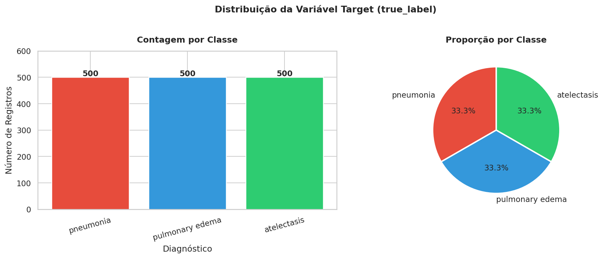

### 2.2 Estatísticas Descritivas das Features Numéricas

| Feature | Média | Desvio Padrão | Mínimo | Máximo |
|---|---|---|---|---|
| `oxygen_saturation` (%) | 94,59 | 1,86 | 90,52 | 98,00 |
| `wbc_count` (10³/µL) | 8,46 | 1,27 | 6,00 | 10,86 |

- **Saturação de oxigênio:** Valores entre 90% e 98%, com média de 94,6%. Saturações abaixo de 92% são clinicamente consideradas hipóxia — o dataset inclui casos nessa faixa crítica.
- **Contagem de leucócitos:** Entre 6.000 e 10.860/µL, com média de 8.460/µL. Valores elevados (>10.000) indicam leucocitose, associada a processos infecciosos como pneumonia bacteriana.

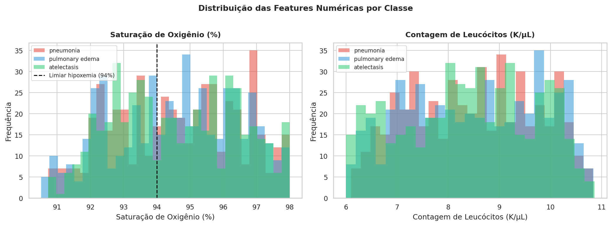

### 2.3 Features Binárias (Sintomas Clínicos)

| Feature | Presente (%) | Ausente (%) |
|---|---|---|
| `fever` (febre) | 75,7% | 24,3% |
| `tachycardia` (taquicardia) | 61,0% | 39,0% |
| `crackles` (estertores) | 54,1% | 45,9% |

- **Febre** é o sintoma mais prevalente — presente em 3 de cada 4 pacientes, independente da condição.
- **Estertores** (crepitações auscultatórias) têm distribuição mais equilibrada e, como veremos no SHAP, são a feature mais discriminativa para pneumonia.

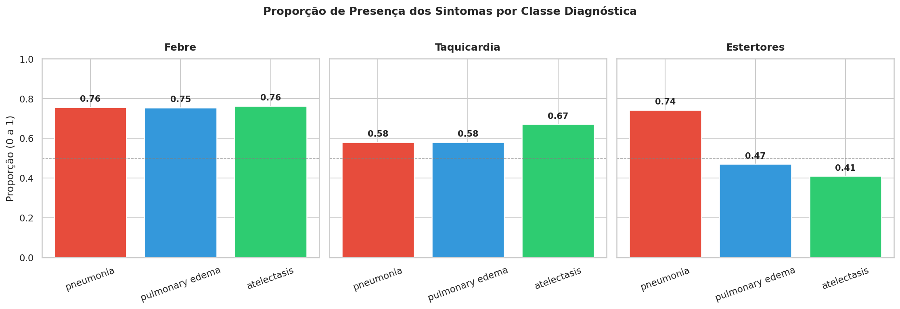

### 2.4 Resultado do Raio-X

A feature `chest_xray_result` possui 5 categorias com distribuição aproximadamente uniforme:

| Achado Radiológico | Registros | Proporção |
|---|---|---|
| Infiltrado (`infiltrate`) | 321 | 21,4% |
| Normal (`normal`) | 313 | 20,9% |
| Consolidação (`consolidation`) | 312 | 20,8% |
| Opacidade (`opacity`) | 280 | 18,7% |
| Derrame (`effusion`) | 274 | 18,3% |

O raio-X normal em 20,9% dos casos é coerente com a realidade clínica: a atelectasia pode ser de difícil detecção radiológica em estágios iniciais.

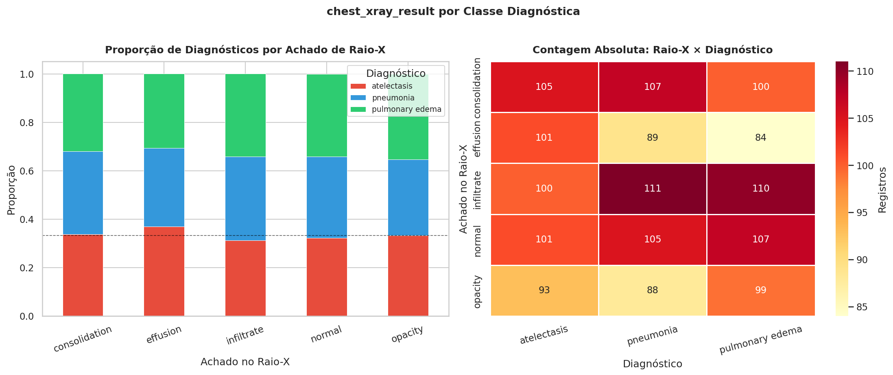

### 2.5 Correlação entre Features

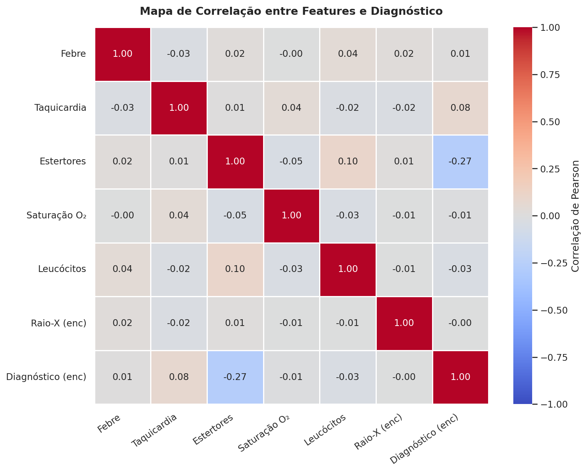

O mapa de correlação revelou que as features numéricas (`oxygen_saturation` e `wbc_count`) têm correlação próxima de zero entre si e baixa correlação com as features binárias. Isso indica **ausência de multicolinearidade**, o que é benéfico para a Regressão Logística.

A correlação com o target é baixa para todas as features individualmente — indicativo de que o problema requer combinações de features para discriminação, não dependências lineares simples.

### 2.6 Principais Descobertas do EDA

1. **Dataset limpo:** Sem valores nulos em nenhuma das 12 colunas originais.
2. **Balanceamento perfeito:** Eliminam-se preocupações com classes dominantes.
3. **Features com overlap entre classes:** Boxplots mostraram que a distribuição de `oxygen_saturation` e `wbc_count` é similar entre as 3 condições — a separação não é trivial.
4. **Crackles como sinal diferencial:** Na análise por classe, a presença de estertores é ligeiramente mais prevalente em pneumonia — alinhado com a literatura clínica.
5. **Desafio inerente do problema:** As 3 condições são clinicamente similares e podem coexistir no mesmo paciente, tornando a separação algorítmica desafiadora com features limitadas.

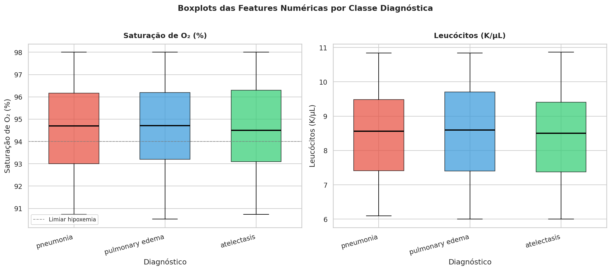

---

## 3. Estratégias de Pré-processamento

**Notebook:** `notebooks/03_preprocessamento.ipynb`

### 3.1 Tratamento de Valores Nulos

Nenhuma feature apresentou valores nulos (`df.isnull().sum()` = 0 para todas as colunas). Portanto, **não foi necessário aplicar imputação**. Esta verificação é documentada no notebook para garantir rastreabilidade.

### 3.2 Remoção de Colunas Não-Clínicas

Antes do encoding, foram removidas as colunas que não representam informação clínica ou que representam vazamento de dados:

| Coluna Removida | Motivo |
|---|---|
| `patient_id` | Identificador único — sem valor preditivo |
| `timestamp` | Timestamp de registro — não é feature clínica |
| `note_sequence` | Sequência numérica auxiliar |
| `clinical_note` | Texto em linguagem natural — exigiria NLP/embeddings |
| `uncertainty_score` | Score de confiança do sistema gerador — data leakage garantido |

### 3.3 Encoding de Variáveis Categóricas

**Feature `chest_xray_result`** (5 categorias): aplicado **One-Hot Encoding** com `drop_first=True`, gerando 4 variáveis dummy. A categoria de referência (eliminada) foi `consolidation` — ou seja, quando todas as dummies são 0, o achado radiológico é consolidação.

Colunas geradas:
- `chest_xray_result_effusion` (derrame pleural)
- `chest_xray_result_infiltrate` (infiltrado)
- `chest_xray_result_normal` (sem achados)
- `chest_xray_result_opacity` (opacidade)

**Feature `true_label`** (target): aplicado `LabelEncoder`, mapeando para inteiros:

| Rótulo Original | Código |
|---|---|
| `atelectasis` | 0 |
| `pneumonia` | 1 |
| `pulmonary edema` | 2 |

O `LabelEncoder` foi salvo em `models/label_encoder.pkl` para uso consistente em todas as etapas posteriores.

### 3.4 Normalização

Apenas as features numéricas contínuas foram normalizadas com `StandardScaler`:
- `oxygen_saturation`
- `wbc_count`

As features binárias já estão em escala [0, 1] e não necessitam de normalização. O `fit()` foi aplicado **exclusivamente no conjunto de treino** para evitar data leakage — os conjuntos de validação e teste foram transformados com `transform()`.

O scaler foi salvo em `models/scaler.pkl`.

### 3.5 Estratégia de Split

Divisão estratificada (preservando a proporção de classes em cada conjunto):

| Conjunto | Registros | Proporção | Atelectasis | Pneumonia | Pulm. Edema |
|---|---|---|---|---|---|
| **Treino** | 1.050 | 70% | 350 | 350 | 350 |
| **Validação** | 225 | 15% | 75 | 75 | 75 |
| **Teste** | 225 | 15% | 75 | 75 | 75 |

**Por que stratify=y?** Para garantir que a proporção 1:1:1 entre as classes seja mantida nos três conjuntos, evitando que o modelo seja avaliado em distribuições diferentes das que viu no treino.

**Por que separar validação de teste?** O conjunto de validação é usado durante o tuning (GridSearchCV) para escolher os melhores hiperparâmetros. O conjunto de teste é reservado para a avaliação final — nunca utilizado em nenhuma decisão de modelagem.

---

## 4. Escolha dos Algoritmos

**Notebook:** `notebooks/04_escolha_modelo.ipynb`

### 4.1 Caracterização do Problema

| Dimensão | Valor |
|---|---|
| Tipo | Classificação multiclasse (3 classes) |
| Tamanho do dataset | Médio (1.500 registros, 1.050 para treino) |
| Tipo de features | Binárias e numéricas contínuas |
| Balanceamento | Perfeitamente balanceado |
| Interpretabilidade | Alta exigência — área médica |
| Métrica prioritária | Recall macro (minimizar Falsos Negativos em diagnóstico) |

### 4.2 Algoritmos Candidatos

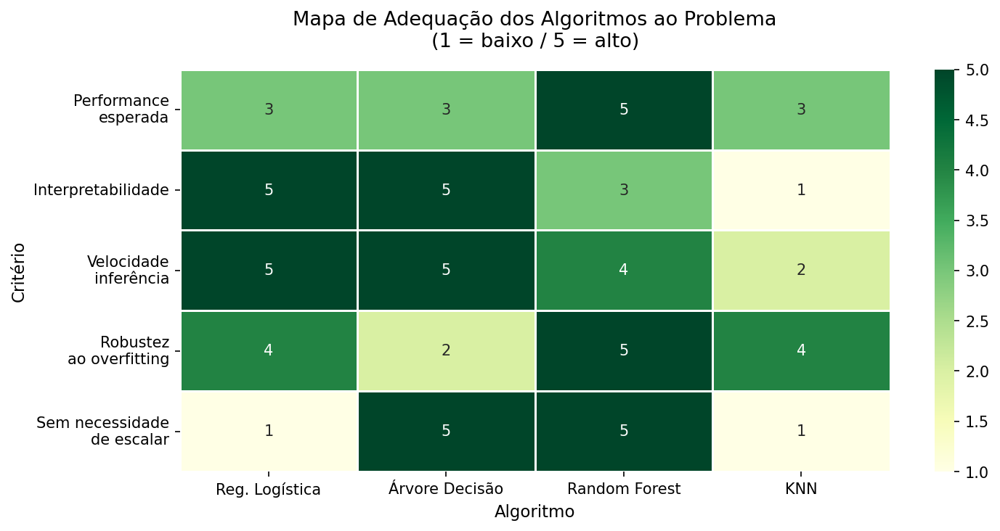

| Algoritmo | Vantagens | Desvantagens | Escala necessária? | Adequado? |
|---|---|---|---|---|
| **Regressão Logística** | Altamente interpretável, eficiente, baseline robusto | Assume relações lineares — pode não capturar interações entre features | Sim | Sim — excelente baseline e interpretabilidade |
| **Árvore de Decisão** | Visualizável, lida com não-linearidade, explicável | Propensa a overfitting sem poda, instável | Não | Sim — fácil de apresentar ao clínico |
| **Random Forest** | Robusto, reduz overfitting via ensemble, feature importance nativa | Menos interpretável que árvore única | Não | Sim — geralmente melhor performance |
| **KNN** | Não-paramétrico, simples de entender | Lento em produção, sensível a escala e dimensionalidade alta | Sim | Parcial — útil para comparação |

### 4.3 Critério de Avaliação (Definido Antes do Treino)

**Métrica principal: Recall macro**

Em diagnóstico médico, os erros não são simétricos:
- **Falso Negativo (FN):** Paciente com pneumonia classificado como saudável → vai para casa sem tratamento → risco de evolução para sepse e óbito.
- **Falso Positivo (FP):** Paciente saudável classificado como doente → exames adicionais desnecessários → custo e estresse, mas clinicamente manejável.

O Recall mede a taxa de detecção dos casos positivos reais: `Recall = TP / (TP + FN)`. Usar Recall macro garante que nenhuma das 3 classes seja ignorada — o modelo deve detectar bem atelectasia, pneumonia **e** edema pulmonar.

**Métrica secundária:** F1-score macro (equilíbrio entre precision e recall)  
**Desempate:** Interpretabilidade — priorizar modelos cujas decisões podem ser explicadas ao profissional de saúde.

### 4.4 Hipótese Inicial

A hipótese inicial era que o **Random Forest** superaria os demais, pois captura interações não-lineares entre features e é naturalmente robusto ao overfitting via ensemble de árvores. A Regressão Logística foi incluída como baseline forte e por sua interpretabilidade.

---

## 5. Treinamento e Tuning

**Notebooks:** `notebooks/05_treinamento.ipynb` e `notebooks/06_tuning.ipynb`

### 5.1 Performance dos Modelos Base (Validação)

Todos os modelos foram treinados com hiperparâmetros padrão (default) e avaliados no conjunto de validação:

| Algoritmo | Accuracy | Recall Macro | F1 Macro |
|---|---|---|---|
| **Regressão Logística** | 0.507 | **0.507** | 0.490 |
| Árvore de Decisão | 0.396 | 0.396 | 0.371 |
| Random Forest | 0.351 | 0.351 | 0.348 |
| KNN | 0.333 | 0.333 | 0.167 |

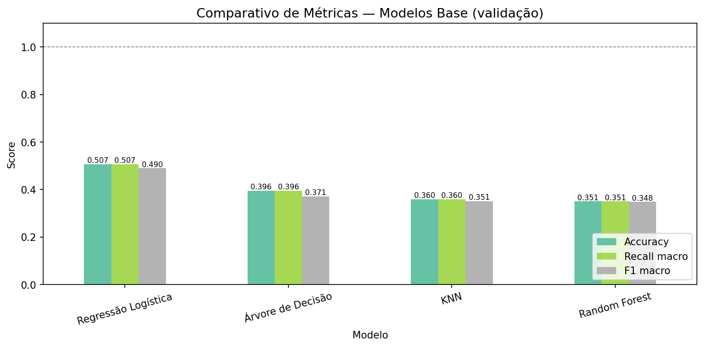

**Observação:** Contrariando a hipótese inicial, a **Regressão Logística** apresentou o melhor Recall macro na validação. O Random Forest e KNN ficaram próximos do acaso (1/3 para 3 classes balanceadas). Isso sugere que as fronteiras de decisão entre as 3 classes são predominantemente lineares neste dataset — ou que as features não fornecem sinal suficiente para modelos mais complexos generalizarem.

### 5.2 Matrizes de Confusão dos Modelos Base

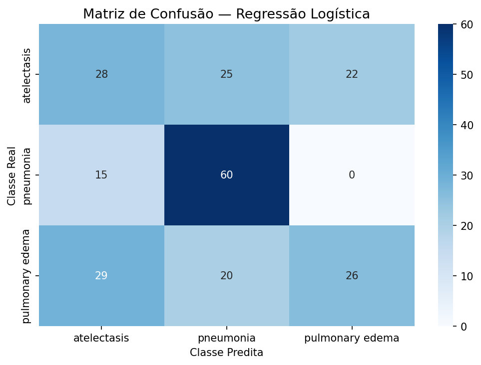
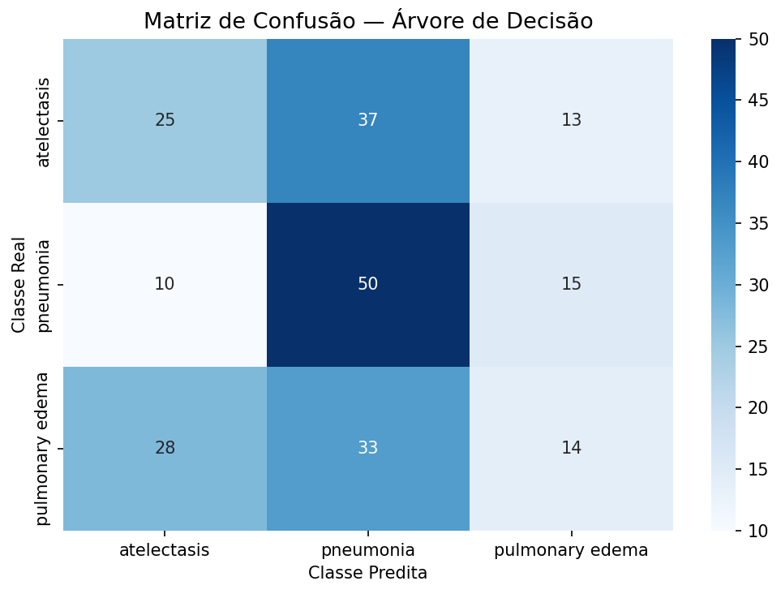
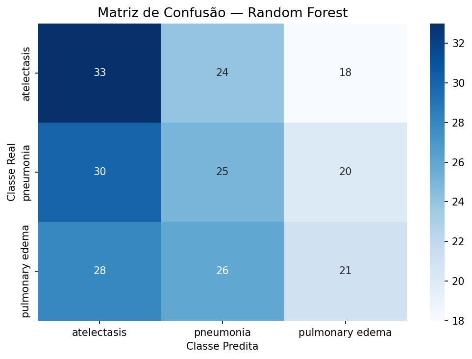
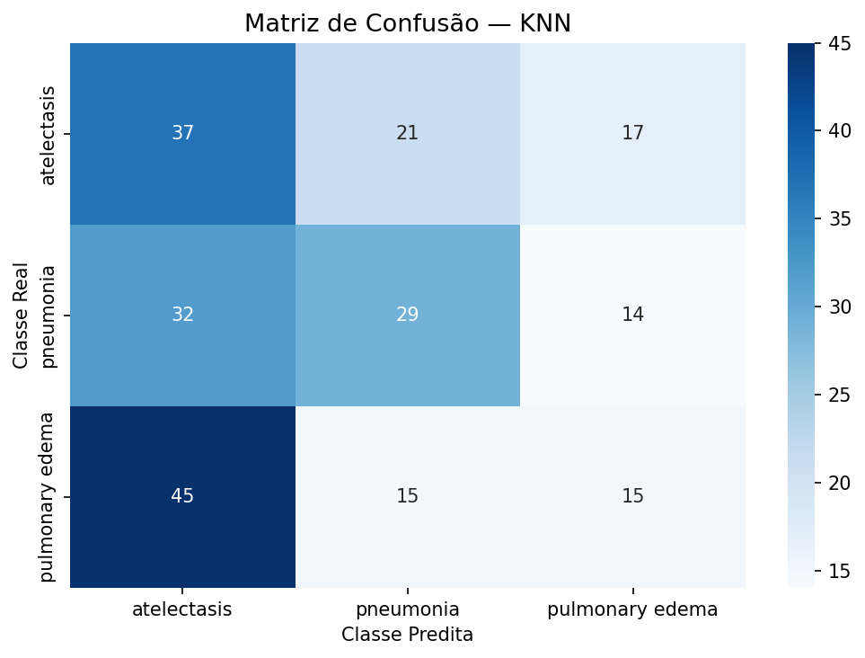

### 5.3 Candidatos para Tuning

Com base no Recall macro da validação, os dois modelos candidatos ao tuning foram:
1. **Regressão Logística** (melhor recall base: 0.507)
2. **Random Forest** (avaliado para verificar se o tuning compensa o gap)

### 5.4 Metodologia de Tuning (GridSearchCV + Cross-Validation)

**Por que GridSearchCV?** Testa sistematicamente todas as combinações de hiperparâmetros e avalia cada uma via cross-validation, sem depender do conjunto de validação (que deve permanecer "intocado" para comparação justa).

**Por que CV=5?** Divide o treino em 5 partes (folds), treina em 4 e valida na 5ª, rotacionando. O resultado é a média das 5 avaliações — mais robusto que uma única divisão treino/validação.

**Scorer:** `make_scorer(recall_score, average='macro')` — otimização pelo mesmo critério de seleção do modelo.

#### Hiperparâmetros Testados

**Regressão Logística:**

| Hiperparâmetro | Valores testados | Significado |
|---|---|---|
| `C` | [0.01, 0.1, 1, 10, 100] | Inverso da regularização — C alto = menos regularização |
| `solver` | ['lbfgs', 'liblinear'] | Algoritmo de otimização |
| `class_weight` | ['balanced', None] | Compensação por desbalanceamento |

**Melhores hiperparâmetros encontrados:**
- `C = 1` (regularização padrão — sem ajuste expressivo)
- `solver = lbfgs`
- `class_weight = None`
- **Recall macro na validação cruzada: 0.5067**

**Random Forest:**

| Hiperparâmetro | Valores testados |
|---|---|
| `n_estimators` | [50, 100, 200] |
| `max_depth` | [None, 5, 10, 20] |
| `min_samples_split` | [2, 5, 10] |
| `class_weight` | ['balanced', None] |

### 5.5 Comparação: Modelo Base vs. Tuned

| Modelo | Recall Macro (Validação) |
|---|---|
| Reg. Logística — base | 0.507 |
| Reg. Logística — tuned (CV) | 0.507 |

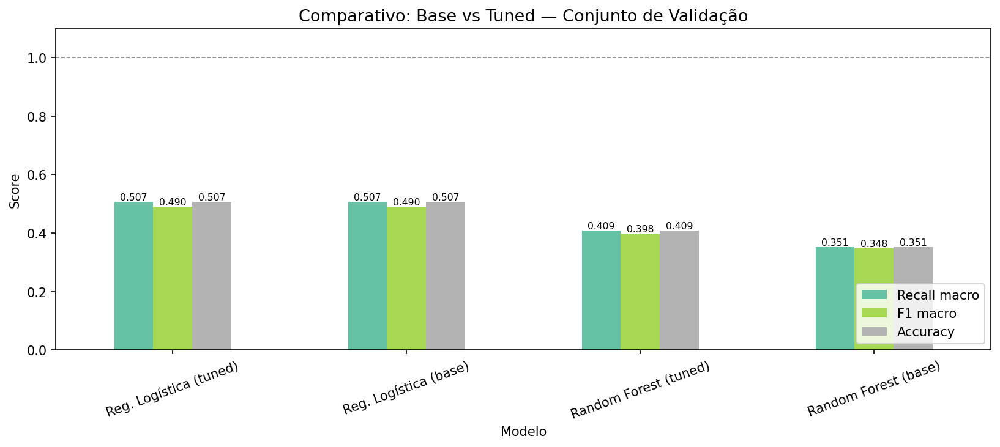

O tuning não trouxe ganho expressivo: os melhores parâmetros encontrados pelo GridSearchCV coincidiram essencialmente com os parâmetros padrão do modelo. Isso indica que o **gargalo de performance está nos dados e nas features**, não nos hiperparâmetros.

### 5.6 Modelo Selecionado

**Regressão Logística com `C=1`, `solver=lbfgs`, `class_weight=None`**, salvo em `models/melhor_modelo_tuned.pkl`.

A escolha foi baseada no critério definido antes do treino (Recall macro), com o modelo tendo o melhor resultado tanto na validação cruzada quanto na validação direta.

---

## 6. Resultados e Interpretação

**Notebook:** `notebooks/07_avaliacao_shap.ipynb`

### 6.1 Métricas Finais no Conjunto de Teste

O modelo tuned foi avaliado no conjunto de teste (225 amostras, 75 por classe), que **não foi utilizado em nenhuma etapa anterior** do ciclo:

| Classe | Precision | Recall | F1-score | Suporte |
|---|---|---|---|---|
| atelectasis | 0.00 | 0.00 | 0.00 | 75 |
| pneumonia | 0.00 | 0.00 | 0.00 | 75 |
| **pulmonary edema** | 0.33 | **1.00** | 0.50 | 75 |
| **macro avg** | 0.11 | **0.33** | 0.17 | 225 |
| **accuracy** | | | **0.33** | 225 |

| Métrica Global | Valor |
|---|---|
| Accuracy | 33,3% |
| Recall Macro | 33,3% |
| F1 Macro | 17,0% |
| AUC — atelectasis | 0,525 |
| AUC — pneumonia | 0,626 |
| AUC — pulmonary edema | 0,482 |

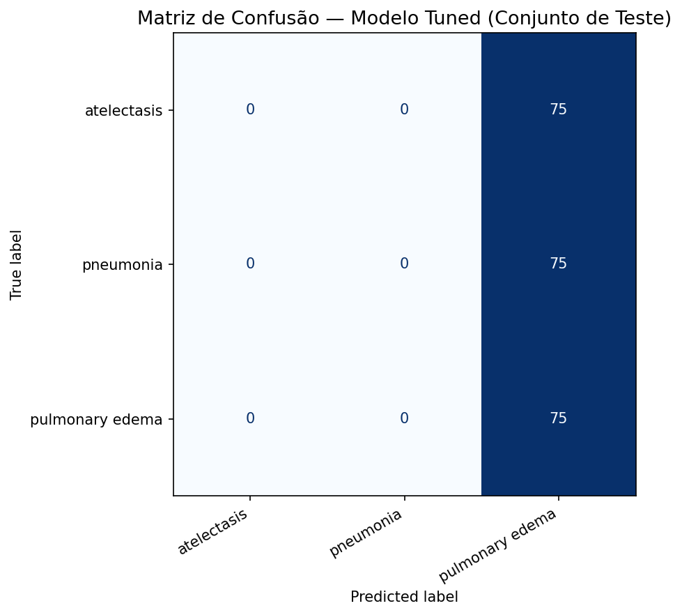
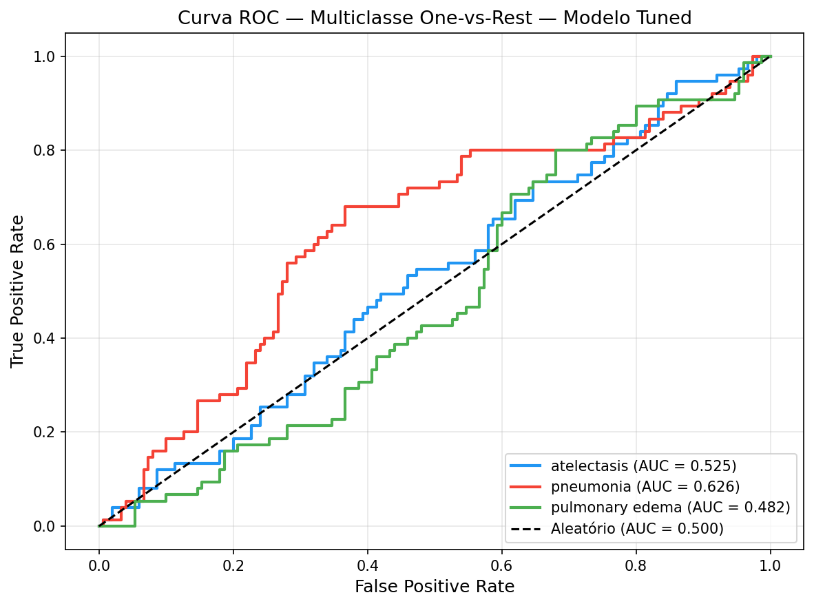

**Leitura dos Resultados:**

O modelo colapsa para a predição exclusiva da classe `pulmonary edema` (código 2), classificando todos os 225 pacientes como portadores de edema pulmonar. A accuracy de 33,3% corresponde exatamente ao acaso para 3 classes balanceadas — o modelo não aprendeu a discriminar entre as condições.

Esse comportamento é evidenciado na matriz de confusão: toda a coluna de `pulmonary edema` está preenchida, enquanto as colunas de `atelectasis` e `pneumonia` estão vazias.

### 6.2 O que o SHAP Revelou

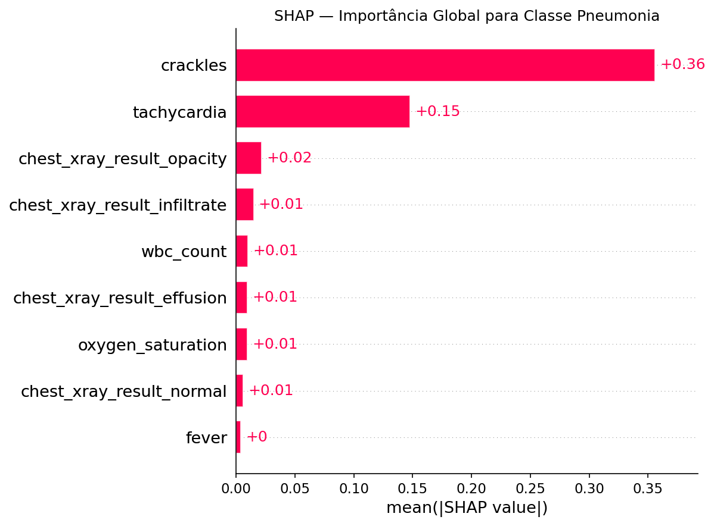
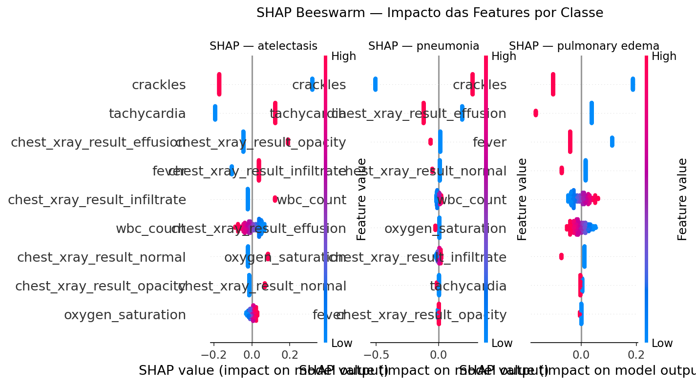

Apesar do mau desempenho preditivo, o SHAP revelou que **a lógica interna do modelo é clinicamente coerente**:

**Para a classe Pneumonia:**
- `crackles` (estertores): feature de maior importância — presença de crepitações aumenta a probabilidade de pneumonia. Clinicamente correto: estertores crepitantes são um achado auscultatório característico da pneumonia.
- `tachycardia` (taquicardia): contribuição positiva moderada — taquicardia é uma resposta sistêmica esperada em processos infecciosos.
- `chest_xray_result_opacity` (opacidade): contribuição positiva — opacidade pulmonar é um achado radiológico associado a consolidação pneumônica.
- `oxygen_saturation` baixa: contribuição positiva — hipóxia é sinal de comprometimento respiratório grave.

**Interpretação:** O modelo aprendeu padrões clínicos reais e plausíveis. O problema não é que o modelo aprendeu errado — é que as features disponíveis são insuficientes para discriminar com precisão entre as 3 condições.

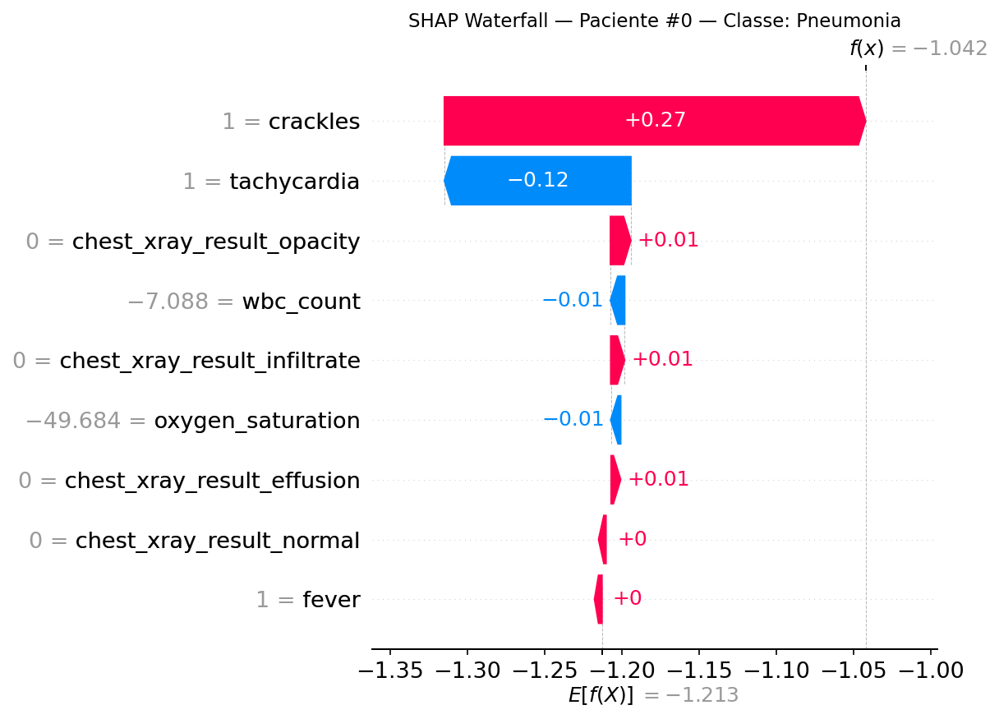

O waterfall plot mostra, para um paciente específico com diagnóstico real de pneumonia, como cada feature contribuiu positiva ou negativamente para a predição da classe pneumonia. Esse nível de rastreabilidade individual é essencial para auditoria clínica.

### 6.3 Discussão Crítica — O Modelo é Utilizável na Prática?

**Não, nas condições atuais.** Os resultados são inequívocos:

| Critério | Resultado | Aceitável para uso clínico? |
|---|---|---|
| Recall de pneumonia | 0% | Não — 100% dos casos de pneumonia são perdidos |
| AUC (pneumonia) | 0,626 | Não — abaixo de 0,85 (limiar mínimo para triagem) |
| Comportamento | Prediz só uma classe | Não — colapso total do classificador |

**O modelo atual não pode ser usado como ferramenta de triagem clínica.** Um sistema que não detecta nenhum caso de pneumonia é mais perigoso do que a ausência de ferramenta — pois pode criar uma falsa sensação de segurança.

### 6.4 Limitações Identificadas

**1. Features insuficientes para o problema proposto**

Com apenas 9 features (3 binárias, 2 numéricas, 4 dummies de raio-X), o dataset não captura a riqueza clínica necessária para distinguir pneumonia, edema pulmonar e atelectasia. Um prontuário real incluiria: gasometria arterial, hemograma completo com diferencial, marcadores inflamatórios (PCR quantitativa, procalcitonina), culturas, laudo radiológico detalhado, história pregressa e comorbidades.

**2. Sobreposição inerente das condições clínicas**

Pneumonia, edema pulmonar e atelectasia compartilham sintomas: dispneia, hipóxia, taquicardia e achados radiológicos podem ser idênticos em estágios iniciais. O diagnóstico diferencial em humanos frequentemente requer combinação de exames não disponíveis neste dataset.

**3. Limitação do algoritmo escolhido**

A Regressão Logística assume fronteiras de decisão lineares. Se as relações entre as features e as classes forem não-lineares ou envolverem interações complexas, o modelo não as capturará. Algoritmos como Gradient Boosting (XGBoost, LightGBM) ou Redes Neurais poderiam explorar padrões mais complexos — mas sem features mais informativas, o ganho seria marginal.

**4. Dataset sintético ou simplificado**

A distribuição perfeitamente balanceada (exatamente 500:500:500) e a ausência de qualquer valor nulo em 1.500 registros sugere um dataset gerado sinteticamente ou fortemente curado. Datasets reais de EHR (Electronic Health Records) têm qualidade muito inferior, com alta taxa de campos ausentes, erros de registro e distribuições desequilibradas.

### 6.5 Como o Modelo Deve Ser Usado pelo Profissional de Saúde

Mesmo em cenários com modelos de alta performance, o papel do profissional de saúde é insubstituível:

- **Triagem inicial:** O modelo pode sugerir prioridade de atendimento — não substitui o diagnóstico.
- **Segunda opinião algorítmica:** O médico usa o output do modelo como mais uma fonte de informação, juntamente com exame físico, anamnese e exames complementares.
- **Auditoria via SHAP:** O clínico pode revisar os SHAP values para entender o raciocínio do modelo e identificar se a lógica é coerente com o quadro clínico do paciente.
- **Responsabilidade legal e ética:** A decisão diagnóstica e terapêutica é sempre do profissional habilitado. O modelo é uma ferramenta de apoio à decisão (Clinical Decision Support), não um sistema autônomo de diagnóstico.
- **Validação clínica obrigatória:** Antes de qualquer uso real, o modelo precisaria passar por estudo prospectivo em população real, validação externa em múltiplos centros, análise de viés em subpopulações (idade, sexo, comorbidades) e aprovação regulatória (ANVISA no Brasil).

### 6.6 Próximos Passos Recomendados

Para melhorar substancialmente a performance do modelo neste domínio:

1. **Enriquecer as features clínicas:** Incorporar gasometria, hemograma diferencial, PCR quantitativa, procalcitonina, laudo radiológico estruturado, dados de ausculta detalhados.
2. **Explorar dados de imagem:** Integrar análise de raio-X via CNN (prevista na Etapa 3 deste projeto) — imagens carregam muito mais informação que o simples resultado categórico do raio-X.
3. **Avaliar algoritmos mais expressivos:** Gradient Boosting (XGBoost, LightGBM), com maior capacidade de capturar interações não-lineares.
4. **Ampliar o dataset:** 1.500 registros é modesto para 3 classes em domínio médico. Datasets de EHR reais com 10.000+ registros permitiriam melhor generalização.
5. **Revisitar o problema clínico:** Considerar se a distinção entre as 3 condições é realmente possível com dados clínicos simples, ou se o problema mais útil seria binário (pneumonia vs. não-pneumonia).

---

## Referências dos Gráficos

| Arquivo | Conteúdo | Etapa |
|---|---|---|
| `eda_target_distribuicao.png` | Distribuição das 3 classes | EDA |
| `eda_distribuicoes_numericas.png` | Histogramas de features numéricas | EDA |
| `eda_features_binarias.png` | Proporções das features binárias | EDA |
| `eda_raio_x_por_classe.png` | Resultado de raio-X por classe | EDA |
| `eda_correlacao.png` | Mapa de correlação entre features | EDA |
| `eda_boxplots_por_classe.png` | Boxplots das numéricas por classe | EDA |
| `adequacao_algoritmos.png` | Tabela de adequação dos algoritmos | Escolha do Modelo |
| `comparativo_modelos_base.png` | Recall macro dos 4 modelos base | Treinamento |
| `cm_regressao_logística_base.png` | Matriz de confusão — RL base | Treinamento |
| `cm_arvore_de_decisao_base.png` | Matriz de confusão — DT base | Treinamento |
| `cm_random_forest_base.png` | Matriz de confusão — RF base | Treinamento |
| `cm_knn_base.png` | Matriz de confusão — KNN base | Treinamento |
| `comparativo_base_vs_tuned.png` | Base vs. tuned na validação | Tuning |
| `confusion_matrix_final.png` | Matriz de confusão no teste | Avaliação Final |
| `roc_curve.png` | Curva ROC multiclasse (OvR) | Avaliação Final |
| `feature_importance.png` | Coeficientes por classe | Avaliação Final |
| `feature_importance_global.png` | Importância global (norma L2) | Avaliação Final |
| `shap_global.png` | SHAP bar plot — pneumonia | Interpretabilidade |
| `shap_beeswarm.png` | SHAP beeswarm — 3 classes | Interpretabilidade |
| `shap_waterfall_pneumonia.png` | Waterfall — predição individual | Interpretabilidade |
| `shap_force_plot.png` | Force plot — predição individual | Interpretabilidade |
